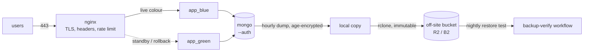

# gsp-ops

Deploy, backup, restore and monitoring tooling for a small Node + MongoDB
service. The app in `app/` is a deliberately small notes API — the operations
around it are the point.

Everything below is measured rather than asserted. The numbers come from
scripts in this repo, and the reports they wrote are committed in
[docs/evidence/](docs/evidence/).

| | Result | How it was measured |
|---|---|---|
| Deploy under load | **69,035 requests, 0 failed** | [`scripts/zero-downtime-test.sh`](scripts/zero-downtime-test.sh) — 20 clients against the live stack while a new release is deployed |
| Rollback | **~1 second** | [`scripts/rollback.sh`](scripts/rollback.sh) — the previous release is still running |
| Restore from a destroyed database | **RTO 15s**, 8 post-backup records lost as expected | [`scripts/restore-drill.sh`](scripts/restore-drill.sh) — deletes the Mongo volume for real, restores from the off-site copy |
| Worst-case data loss | **60 minutes** | the hourly backup interval, see [Recovery objectives](#recovery-objectives) |

The same scripts run end to end in CI on every push, so none of this is a
one-off: [`.github/workflows/ci-cd.yml`](.github/workflows/ci-cd.yml).

Further reading:

- [docs/operations-plan.md](docs/operations-plan.md) — taking over the wider
  estate: what to secure first, backup design, provider failover, DNS changes
- [docs/decisions.md](docs/decisions.md) — why things are built the way they
  are, with the measurements behind the choices
- [docs/evidence/](docs/evidence/) — raw output from the runs above

If you are reading this because something is broken right now, go straight to
[Site is down at 2am](#site-is-down-at-2am).

---

## What this is

```
app/                  Express + mongodb driver, Dockerfile, tests
compose/              docker-compose.yml: mongo, app_blue, app_green, nginx
nginx/                nginx.conf, site config, njs traffic switch
mongo/init/           creates the least-privilege app and ops users on first boot
scripts/              deploy, rollback, backup, restore, restore-drill, healthcheck, status
.github/workflows/    ci-cd, uptime (external check), backup-verify (nightly)
ops/cron/             host cron entries for backups and health checks
```



Two networks: `edge` has nginx and the apps, `data` is `internal: true` and
has the apps and Mongo. nginx cannot reach Mongo, and Mongo has no route out
and no published port. Mongo runs with `--auth`; the app connects as `app`
(readWrite on the `gsp` database only), backup and restore use `ops`
(backup + restore roles). Root is used only by the image's first-boot init.

Both colours run from the same compose file. nginx picks one per request by
reading `nginx/live/color`, so switching is an atomic file rename rather than
a reload — a reload drops a few connections under load
([measured](docs/decisions.md#bluegreen-switch-without-reloading-nginx)).

## Running it locally

Needs Docker with Compose v2.17+, and on the host: `bash`, `curl`, `jq`,
`openssl`, `age`, `flock` (util-linux), `node` (for the load generator), plus
`rclone` only if you want a real off-site bucket. On Debian/Ubuntu:
`sudo apt-get install -y jq age nodejs util-linux`.

```bash
make setup     # .env, secrets/, backup keypair, self-signed cert
make up        # build the image and do the first deploy
make status

curl -k https://localhost:8443/readyz
curl -k -X POST https://localhost:8443/api/notes \
  -H 'Content-Type: application/json' -d '{"title":"hello"}'
```

`make setup` prints where the backup private key went. Read that message —
you need that file to restore.

## Testing it

```bash
cd app && npm ci && npm test     # 12 unit tests; the integration test is
                                 # skipped unless MONGO_TEST_URI is set
npm run lint
shellcheck -x scripts/*.sh scripts/lib/*.sh mongo/init/*.sh
```

The parts worth testing are the ops scripts, and unit tests say nothing about
those. So CI brings the whole stack up inside the runner and runs the real
scripts end to end: first deploy, a deploy under load, rollback, backup, and
the full restore drill. If a change breaks restore, CI goes red before anyone
needs the restore. You can run the same thing locally:

```bash
make build TAG=v2
scripts/zero-downtime-test.sh v2 60                      # must report 0 failures
scripts/restore-drill.sh --identity ~/.config/gsp/backup-identity.txt
```

## Deploying

Push to `main`. The pipeline runs gitleaks over the whole history, lint, unit
and integration tests, shellcheck, the stack rehearsal above, and a Trivy
scan of the image. Only then does it push `ghcr.io/<owner>/gsp-ops:sha-<commit>`
and SSH to the server to deploy. Images are always tagged by commit, never
`latest`, so any past release can be redeployed by name.

By hand on the server:

```bash
cd /opt/gsp
APP_IMAGE=ghcr.io/<owner>/gsp-ops scripts/deploy.sh sha-<commit>
```

`deploy.sh` starts the idle colour on the new tag, waits for its Docker
healthcheck (which hits `/readyz`, so a release that cannot reach the database
never gets traffic), writes the new colour to `nginx/live/color`, then calls
`/readyz` back through nginx and checks the colour and version match what it
just deployed. If the health check fails it stops before switching and nothing
user-facing changed; if the smoke test fails it flips back and exits non-zero.
Either way the old colour stays running as the rollback target.

**Measured:** 69,035 requests at ~1,150 req/s across a deploy, 0 failed
([evidence](docs/evidence/)). CI runs the same check on every push.

## Rolling back

Bad release, previous one still running — the usual case:

```bash
scripts/rollback.sh          # flips the colour file back, ~1 second
```

It refuses if the previous colour is not healthy. If that colour is gone (host
rebooted, or you need to go back more than one release), redeploy by tag:

```bash
tail deploy/history.log                  # find the last good tag
scripts/deploy.sh sha-<last-good-commit>
```

A code rollback does not undo writes. This app has no schema migrations; one
that does should use expand/contract (add, dual-write, remove in a later
release) so the previous release still works against the new schema. If data
is actually damaged, that is a restore, not a rollback.

After any rollback, revert or fix the commit on `main`, or the next push
redeploys the bad code.

## Backups

`scripts/backup.sh`, hourly at :07 from cron (`ops/cron/gsp`):

1. `mongodump --archive --gzip` of the `gsp` database as the `ops` user. The
   password goes through a temporary `--config` file inside the container, not
   argv, which every user on the host can read via `ps`.
2. Piped straight into `age`, encrypted to `secrets/backup.age.pub`. Nothing
   unencrypted is written to disk.
3. Saved locally with a `.sha256`. Local copies kept 48h.
4. Copied off-site with `rclone copy --immutable` (R2 or B2), or to
   `OFFSITE_DIR` when simulating a second location.
5. Writes `.last_success`, which the health check watches. A failure posts to
   the alert webhook.

The server holds only the **public** key, so whoever takes the box can make
new backups but cannot read old ones. The private key is kept offline and in
the `BACKUP_AGE_IDENTITY` GitHub secret for the verify job.

Off-site retention is a bucket lifecycle rule, not a `delete` in the script,
and the server's key is write-only. A compromised server then cannot wipe
backup history, which is what ransomware goes for.

`.github/workflows/backup-verify.yml` runs nightly: pulls the newest off-site
backup, fails if it is older than 2h, checks the sha256, decrypts it, restores
into a throwaway Mongo and checks there is data in it. A backup nobody has
restored is not a backup.

## Restoring

```bash
scripts/restore.sh --identity /path/to/backup-identity.txt
```

Defaults to the newest backup in the **off-site** location, because if you are
running this for real the local disk is probably what you lost. Use
`--source local|offsite|offsite-dir` and `--file <name>` to pick another.

It verifies the checksum and that the key can decrypt *before* touching the
database, asks you to type the database name before dropping anything (`--yes`
to skip), restores with `--drop` scoped to `gsp.*`, then waits for `/readyz`
through nginx. It prints how long each phase took.

Before you restore: check the database is actually gone or corrupt rather than
just slow (`make status`, `docker compose logs mongo`); decide which backup you
want, since the newest is wrong if the problem is bad data that got backed up;
and note the backup's timestamp, because that is your real data-loss window.

### The drill

```bash
scripts/restore-drill.sh --identity /path/to/backup-identity.txt
```

Destroys the Mongo container **and its volume**, restores from the newest
off-site backup, and measures it. It writes a marker record first, which
should not survive — if it does, the drill did not really destroy anything.
It deliberately uses the last scheduled backup rather than taking a fresh one,
since a backup taken a second before the disaster makes the RPO meaningless.
Report goes to `docs/evidence/restore-drill-*.md`.

## Recovery objectives

From [the drill run in docs/evidence](docs/evidence/) (28 records at the time
of loss, 20 in the backup):

| | Target | Measured | |
|---|---|---|---|
| RTO (restore only) | 4h | **15s** | volume destroyed → `/readyz` 200 through nginx |
| RPO (this run) | 1h | **140s** | age of the backup at the moment of loss |
| Records lost | | **8** | everything written after that backup, marker included |

The 140s is the age of the backup in that particular run, not the guarantee.
**The honest RPO is the backup interval: 60 minutes worst case**, plus the time
to ship the file off-site. That meets the 1h target with no margin. Getting it
to minutes needs Mongo as a replica set with continuous oplog backup
(point-in-time restore), which is the first thing I would change for
production.

The 15s is recovery time only. The full budget also includes:

- **Detection.** The host checker alerts after 2 failed 1-minute checks; the
  external checker runs every 5 minutes and GitHub's scheduler can run late.
  Call it 2–10 minutes.
- **Decision.** Someone has to be reached, read the alert and decide to
  restore. Realistically 15–30 minutes at night.
- **Host loss.** The drill loses the database, not the machine. Rebuilding a
  server adds provisioning time — see the provider-failure walkthrough in the
  [operations plan](docs/operations-plan.md).

## Monitoring and alerts

Three checks, because each one alone has a blind spot:

| Check | Runs | Catches | Misses |
|---|---|---|---|
| Docker healthchecks | every 5s per container | dead app or Mongo; gates the deploy | anything outside the box |
| `scripts/healthcheck.sh` (cron, 1 min) | on the host | `/readyz` via nginx, backups going stale (>90 min), disk >85% | the host dying, the network path |
| `uptime.yml` (Actions, 5 min) | outside | DNS, TLS, network, host down | backup and disk state |

Alerts go to a Discord or Slack webhook (`ALERT_WEBHOOK_URL`). The host checker
alerts after 2 consecutive failures, sends one message per incident, and sends
a recovery message when it clears — see
[docs/evidence/alert-fired-*.txt](docs/evidence/) for a real run of exactly
that sequence.

`/healthz` is liveness only and does not check Mongo, so a database blip does
not restart containers in a loop. `/readyz` checks Mongo and returns 503 while
draining on shutdown. Both report the colour and version, which is how you tell
what is live.

## Site is down at 2am

Work top to bottom. Do not change two things at once. Note the time of each
step in the incident channel as you go.

**0. Get the picture.**

```bash
ssh deploy@<host>
cd /opt/gsp && scripts/status.sh
```

Paste the output into the incident channel. It shows containers, the live
colour and version, `/readyz`, the last backup and disk usage.

**1. Is it us, or the path to us?**

```bash
curl -sk -o /dev/null -w '%{http_code}\n' https://localhost:8443/readyz
```

200 from the host but users see errors means DNS, Cloudflare, TLS or firewall:
check Cloudflare's status page, the zone's DNS records, and that the origin
firewall still allows Cloudflare's IP ranges. Not 200: carry on.

**2. Is nginx up?** If `status.sh` does not show it healthy,
`docker compose -p gsp logs --tail 50 nginx` — usually a config error or a
missing/expired cert. After fixing:
`source scripts/lib/common.sh && dc up -d nginx`.

**3. Is the live app up?**

```bash
cat nginx/live/color
docker compose -p gsp logs --tail 100 app_$(cat nginx/live/color)
```

If it started failing right after a deploy, `scripts/rollback.sh` and fix
later. If it is crash-looping on something else (out of memory, bad secret)
and the other colour is healthy, rollback still buys you time.

**4. Is Mongo up?** `docker compose -p gsp logs --tail 100 mongo`.

- Disk full: `df -h`, `docker system df`, then `docker image prune -a` (not
  volumes). Mongo usually recovers once there is space.
- Won't start, data files corrupt, or the data is gone: this is a restore.
  Read [Restoring](#restoring) including the checklist, then run
  `scripts/restore.sh`. Tell stakeholders roughly how much data will be lost —
  the time since the backup you are using.

**5. Is the host itself OK?** `uptime`, `free -m`, `df -h`, `dmesg | tail`. If
the host is gone or the provider is down, this runbook's scope ends — go to the
provider failover plan in the [operations plan](docs/operations-plan.md).

**Afterwards:** write the timeline down while it is fresh — what the alert
said, what fixed it, and what would have caught it sooner.

## Secrets

Nothing secret is in the repo. `.env` and everything in `secrets/` are
gitignored; `.env.example` has no real values. gitleaks runs in CI over the
whole history (a secret deleted in a later commit is still leaked) and as a
pre-commit hook (`pre-commit install`).

Secrets reach containers as Docker secrets — files under `/run/secrets`, not
environment variables, which show up in `docker inspect`. In GitHub: the deploy
SSH key and a pinned host key, the webhook URL, the backup identity, and a
read-only bucket key for the verify job. The deploy job runs in a `production`
environment so it can require approval. Workflow permissions default to
`contents: read`; only the build job gets `packages: write`, and third-party
actions are pinned to commit SHAs.

To rotate a Mongo password: change the file in `secrets/`, update the user with
`db.changeUserPassword`, then deploy — containers read secrets at start.

## Going to a real server

Not needed to run this locally. On a real host:

1. Non-root `deploy` user owning `/opt/gsp`, in the `docker` group. SSH keys
   only, `PermitRootLogin no`, `PasswordAuthentication no`.
2. Firewall: 22 from known admin IPs, 80/443 from
   [Cloudflare's ranges](https://www.cloudflare.com/ips/) only.
3. Cloudflare Full (strict) with an Origin CA certificate in `nginx/certs/`,
   Authenticated Origin Pulls on.
4. `unattended-upgrades` for security patches.
5. `rclone config` for the bucket with a write-only key; set `OFFSITE_REMOTE`.
6. `sudo cp ops/cron/gsp /etc/cron.d/gsp` and `ops/logrotate-gsp` into
   `/etc/logrotate.d/`.
7. `docker login ghcr.io` with a read-only packages token.
8. In GitHub: `DEPLOY_ENABLED=true`, `DEPLOY_HOST`, `PUBLIC_URL`, and the
   secrets above.
9. Pin the Node base image to a digest (comment in `app/Dockerfile`).
10. Run the drill once on the real server before calling it done.

## Known limitations

Things I know about and deliberately left out of this build:

- **Single host.** Blue/green protects against bad releases, not against losing
  the machine. Surviving the loss of a provider is what the
  [operations plan](docs/operations-plan.md) covers.
- **Hourly dumps, not point-in-time recovery.** RPO is 60 minutes worst case. A
  replica set with oplog backup gets this to minutes.
- **Standalone Mongo.** No replication, no automatic failover. A single-node
  replica set would at least give us the oplog.
- **The off-site path is exercised as a second directory**, not against a real
  R2/B2 bucket — no bucket has been provisioned yet. The `rclone` branch and
  the nightly `backup-verify` workflow are written but unproven against a live
  bucket.
- **njs reads a file per request** for the colour switch. Fine at this scale;
  at high volume a shared dict or nginx `keyval` would be better.
- **Schema changes** are not handled by the deploy. The app has none; a real one
  needs expand/contract migrations and a pipeline step.
- **Secrets are files on the host.** For a team, SOPS or a secret manager with
  an audit log beats files managed by hand.
- **Monitoring is up/down only.** No metrics or latency alerts. Prometheus with
  blackbox exporter and Grafana is the next step.
- **GitHub scheduled workflows are best effort** and can run late, which is why
  the host cron checker exists.
